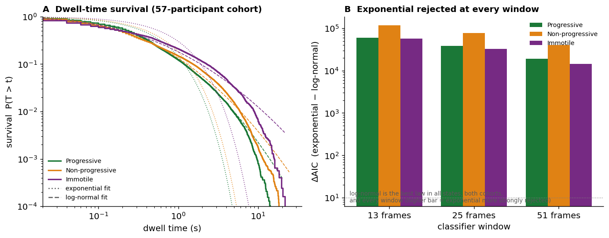
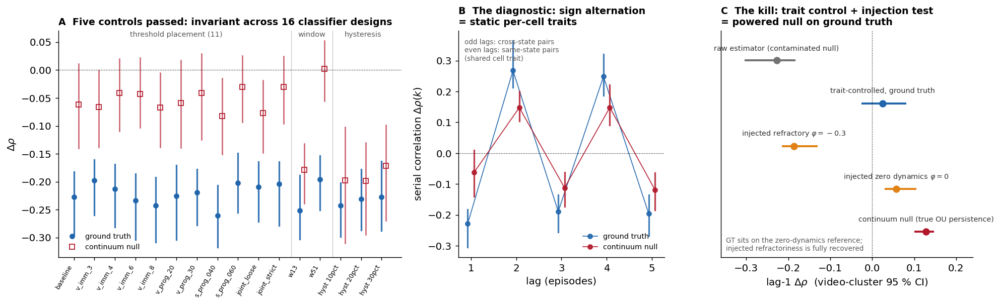
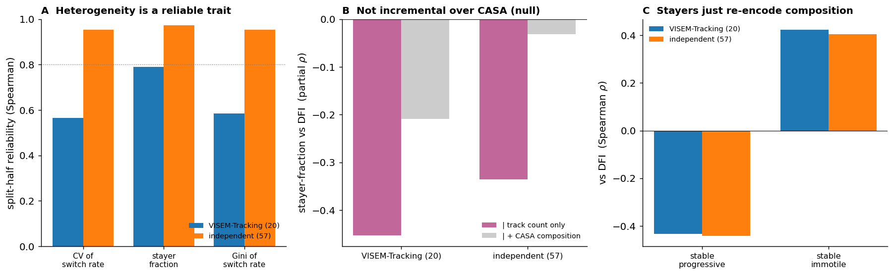

# The measurement pipeline manufactures non-Markovian event dynamics: a three-layer validation protocol for detect–track–discretise pipelines in single-cell microscopy

*Working manuscript draft — the methodological core of Work Package 4 (Event Detection
and Tracking) of the doctoral project "Shape representation and event detection of
sub-cellular structures in high-content/high-throughput microscopy" (UiT, BioAI group).
The deliverable is a validation protocol for event detection in
detect–track–represent–detect-events pipelines; sperm motility is the demonstration
corpus (the richest annotated single-object tracking resource available), and
sub-cellular structures such as mitochondria are the target domain. Primary evidence:
1,138 hand-annotated single-cell trajectories (VISEM-Tracking ground truth, 20 videos), a
matched Markovian-continuum null passed through the identical classifier, and a
four-pipeline tracking-fidelity audit on the annotated videos.*

---

## Abstract

Event detection in high-content microscopy typically proceeds by detecting objects,
tracking them, discretising a continuous phenotype into a small state vocabulary, and
reading the state *transitions* as the events. Reports of "non-Markovian" event dynamics
from such pipelines are widespread — heavy-tailed state dwell times, memory beyond the
current state, stable object-to-object heterogeneity — and they shape both biological
conclusions and downstream models. Here we ask when detected event dynamics are real,
and answer with a **three-layer validation protocol** — a matched continuum null passed
through the identical classifier (representation layer), an annotation-anchored tracking
audit scored on downstream dynamical observables (tracking layer), and estimator
validation by injection of known dynamics (estimation layer) — exercised exhaustively on
the largest hand-annotated single-cell motility resource available (1,138 human-verified
spermatozoon trajectories, 656,145 frame-states, VISEM-Tracking). For the canonical CASA
motility states, the entire non-Markovian phenomenology is manufactured by the
measurement machinery itself — the classifier, the tracker, and, most insidiously, the
statistics. The continuum null — per-track Ornstein–Uhlenbeck velocity processes fit
only to each trajectory's velocity marginal and lag-1 autocovariance, passed through the
identical windowed state classifier and scoring code, containing no switching biology at
all — reproduces or exceeds every headline non-Markovian statistic: log-normal dwell laws in every state (ΔAIC over
exponential up to +4,490), a second-order memory gain of +0.052 per token (170 % of the
observed +0.030), window-robustness of that gain, apparent cell-to-cell heterogeneity
(ICC 0.13 vs 0.10 observed), sub-exponential within-cell dwell regularity, and it even
deceives a hierarchical empirical-Bayes decomposition into attributing 54 % "genuine
within-cell memory" to a memoryless process. Resolution and censoring audits further show
the motile dwell laws have barely one decade of dynamic range above the classifier window,
and the immotile dwell law is unidentifiable (64 % of immotile episodes touch a track
boundary; 41 % are whole tracks). **One statistic initially survives every control**:
successive dwell durations of the same cell anti-correlate far beyond the continuum null
(Δρ = −0.23, video-cluster bootstrap CI [−0.30, −0.18]; null −0.06; difference CI
excludes zero), robustly to leave-one-video-out, to a per-cell estimator, to merging up
to 38 % of episodes as suspected classifier flicker, and invariantly across sixteen
classifier configurations — thresholds, windows, and hysteresis. It is not biology
either. The serial correlation *alternates in sign with lag* (−0.23, +0.27, −0.19,
+0.25, −0.20) — the parity signature of static per-cell traits, not of dynamics:
successive episodes are by construction different states, while the statistic's
within-cell permutation null mixes in same-state episode pairs that share each cell's
own dwell level, inflating the null and manufacturing a negative Δρ from zero dynamics.
A trait-controlled estimator (per-cell-per-state centring) returns Δρ = +0.03
[−0.03, +0.08]; an injection test proves this null is powered (refractory dynamics
injected at φ = −0.3 into the real episode structure are recovered at −0.19
[−0.22, −0.13], and the same estimator detects the genuine velocity persistence of the
continuum null); and per-track Fano factors of switch counts are Poisson-or-above
(1.0–1.7), not sub-Poisson. The estimator, not the cell, was refractory — and it fooled
five independent, publication-grade robustness controls before the sixth caught it.
Automated tracking inflates the artefactual statistics a further ~1.9-fold. Nothing
measurable at these track lengths supports non-Markovian switching biology in human
sperm. Our results re-open the interpretation of non-Markovian claims from
track-then-discretise pipelines across fields. The protocol is pipeline-agnostic and
transfers directly to event detection in sub-cellular structures — mitochondrial fission
and fusion are identity events read through the same detect–track–discretise machinery —
where none of its three controls are currently standard.

---

## 1. Introduction

A recurring problem in high-content and high-throughput microscopy is to turn long image
sequences of many moving biological objects into a compact description of their *state* and
of the *events* — the changes of state — that they undergo over time. This couples two
sub-problems: a *representation* problem (choosing a small vocabulary of canonical states
for objects whose morphology or behaviour is in reality continuous and pleomorphic) and an
*event-detection* problem (modelling how a tracked object transitions between those states
along its trajectory). We study both in the setting that yields the richest single-object
statistics available to us — the motility of individual human spermatozoa imaged by video
microscopy — and use it to expose a general failure mode of the standard approach: a coarse
discrete state vocabulary combined with a memoryless transition model systematically
mis-describes the events. Sperm motility is thus the primary use case for a methodology
whose target domain is event detection in tracked biological structures.

Semen motility is clinically scored by CASA as the proportion of spermatozoa that are
progressively motile, non-progressively motile, or immotile at one instant [3–5]. This reduces
a population of independently swimming cells, each following its own time-varying
trajectory, to three numbers — a discretisation of a continuous kinematic phenotype into
three canonical states, exactly the kind of state vocabulary the representation problem
must supply. Two modelling assumptions are built into this reduction and
into the Markov-chain models commonly fitted to CASA state sequences: (1) *memorylessness*
— a cell's next state depends only on its current state; and (2) *homogeneity* — all cells
are draws from one transition process. Neither has been tested at scale on single-cell
trajectories.

We test both directly — and then we test the tests. Hand-annotated tracking yields
thousands of verified state-switching events, enough to characterise the *distribution*
and *temporal structure* of motility switching rather than only its mean. On these
trajectories the standard analyses report exactly what the recent literature on tracked
behaviour would predict: heavy-tailed dwell laws, second-order memory, and stable
cell-to-cell heterogeneity [8–13, 17]. The central contribution of this paper is a validation
protocol — three controls, one per layer at which the pipeline can manufacture event
dynamics, none of which track-then-discretise studies usually run — together with the
demonstration of how much of the standard phenomenology fails it.
The first is a *continuum null*: a memoryless (Markovian) continuous motion model,
fit per track to nothing but the velocity marginal and its lag-1 autocovariance, passed
through the identical windowed classifier — which turns out to manufacture the entire
non-Markovian phenomenology, and more of it than the data show. The second is an
*annotation-anchored tracking audit*, which shows automated tracking inflates the same
statistics a further two-fold while erasing within-cell temporal structure. One
statistic survives both controls and four further robustness tests — an apparent
refractory anti-correlation of successive dwells — and became, for a time, this paper's
sole biological claim. A final control kills it: the statistic's own permutation null is
contaminated by static per-cell heterogeneity, and a trait-controlled estimator, proven
powered by an injection test, finds no dynamic signal at all. We report the forensic
sequence in the order it happened, because the order is itself the finding: five
independent, publication-grade robustness checks — cluster inference, leave-one-out,
per-cell estimation, adversarial flicker merging, a sixteen-configuration classifier
sweep — were structurally blind to the artefact. Finally we ask whether anything
discarded by the population average carries clinical signal.

---

## 2. Data and methods

**The validation protocol.** The methods below instantiate three general controls, one
per layer at which a detect–track–discretise pipeline can manufacture event dynamics:
**P1 (representation)** — a matched memoryless continuum null passed through the
identical classifier and scoring code ("Continuum null"); **P2 (tracking)** — an
annotation-anchored audit in which automated pipelines are scored on the downstream
dynamical observables themselves, not only on MOT identity metrics [28–30]
("Tracking-fidelity audit"); **P3 (estimation)** — validation of every serial statistic's null distribution
by injecting known dynamics into the real data's trait structure ("Point-process
statistics"). The remaining methods are the machinery needed to run these controls
honestly at scale.

**Data tiers.** All headline dynamical statistics are computed on *ground-truth* (GT)
trajectories: the 20 VISEM-Tracking [2] videos (50 fps) whose per-frame bounding boxes carry
human-verified persistent identities (`labels_ftid`), materialised into 1,138 single-cell
tracks with 656,145 frame-states (`experiments/gt_reanchor.py`). Two further tiers are
analysed *identically* but serve distinct, subordinate roles and are never pooled with GT:
(a) the *same 20 videos* re-tracked by automated pipelines — our fine-tuned detector with
BoT-SORT+ReID [32] (the baseline), BoT-SORT without ReID, and ByteTrack [31] — used exclusively for
the tracking-fidelity audit (§3.5); (b) *extra57* = 57 further VISEM participants with no
ground truth, tracked with the baseline pipeline (fine-tuned YOLOv8-l [33] + BoT-SORT), used
only for pipeline-level replication and for per-participant clinical traits. Clinical
variables (including DFI [7]) come from the VISEM [1] clinical tables (n = 85); 77 participants
have both tracks and clinical data. Cross-participant statistics are computed within
cohort, never pooled (tracking pipeline is a batch effect).

**States.** For each track we assign a per-frame motility state
{Progressive, Non-progressive, Immotile} from kinematic parameters (VCL, STR, …) computed
over a 0.5 s (25-frame) sliding window, following standard CASA thresholds [3–5]. A *dwell* is a
maximal run of one state along a track; a *switch* is a change of state.

**Dwell-time law (Fig. 1).** Pooling dwell episodes per state and cohort, we fit
exponential, gamma, Weibull and log-normal laws by maximum likelihood (location fixed at
0) and compare by AIC; heavy-tail model competitions of this kind are notoriously
sensitive to fitting practice [18, 19]. Robustness is assessed by recomputing states at window sizes 13, 25
and 51 frames (`experiments/dwell_physics.py`, `dwell_physics_robust.py`).

**Order test (Fig. 2A).** To quantify memory we compare held-out per-token log-likelihood
of Markov models of order 0–3 by 5-fold cross-validation over tracks. Because the
sliding-window state series is ≈ 88 % autocorrelated between adjacent frames, the order
test is run on **decorrelated, non-overlapping 0.5 s blocks** (one state per block); the
2nd-over-1st gain g₂ = ℓ₂ − ℓ₁ is the memory statistic (`markov_property_test.py`,
`replicate_markov_extra.py`).

**Decomposition of the memory (Fig. 2).** We separate within-cell memory from population
heterogeneity — the classic mover–stayer confound [27] — with three parametric-bootstrap
nulls that all preserve track lengths and
re-run the identical order test (`mover_stayer_null.py`, `mover_stayer_eb.py`):
- **HOM** — every track simulated from a single pooled first-order matrix (no heterogeneity);
- **HET (over-fit)** — every track simulated from its *own* fitted first-order matrix
  (maximal, noise-inflated heterogeneity; an upper bound on the aggregation artefact);
- **EB (fair)** — a hierarchical Dirichlet–multinomial: per context, per-cell transition
  rows are drawn from Dir(kₐ·mₐ) with concentration kₐ fit by maximum marginal likelihood,
  reproducing the *estimated true* between-cell heterogeneity without over-fitting.
The genuine-memory share is (g₂ᴿᴱᴬᴸ − g₂ᴱᴮ)/(g₂ᴿᴱᴬᴸ − g₂ᴴᴼᴹ); the aggregation share is its
complement. We corroborate with the ratio of within-track to pooled dwell CV
(`memory_decomposition.py`).

**Refractoriness test.** Within each cell we compute the lag-1 Spearman correlation of
successive state-controlled residual log-dwell durations and compare it with a
within-cell permutation null that preserves each cell's dwell multiset (so censoring and
heterogeneity cannot produce a spurious signal); the statistic is Δρ = ρ_obs − ρ_null.
All inference is by **video-level cluster bootstrap** (videos resampled with replacement),
with leave-one-video-out ranges and a per-cell Fisher-z estimator as corroboration
(`memory_decomposition.py`, `refractory_survivor.py`).

**Continuum null (the decisive control).** For every ground-truth track we fit a 2-D
Ornstein–Uhlenbeck [20] (discrete AR(1)) velocity process — Markovian by construction — to
that track's velocity marginal (per-component mean, variance) and pooled lag-1
autocovariance, and nothing else; no memory statistic is ever fit. We simulate one
synthetic track per real track at the identical length (censoring reproduced by
construction; per-track parameters preserve quenched heterogeneity), then pass the
synthetic positions through the *identical* windowed classifier and the identical scoring
code for every statistic in this paper (`continuum_null.py`).

**Resolution and censoring audits.** Per state we report the fraction of dwell episodes
shorter than 1×/2×/3× the classifier window, re-fit the law competition restricted to
dwells ≥ 3× window, and repeat the full competition at windows of 5, 9 and 13 frames
(below the mean motile dwell). We report the fraction of episodes touching one or both
track boundaries, re-fit all laws by censored maximum likelihood (interior episodes
contribute density, boundary episodes survival), and redo the ground-truth-vs-automated
dwell contrast with ground-truth tracks truncated to the automated track-length
distribution (`dwell_resolution_audit.py`).

**Threshold and classifier-design sweep.** The refractoriness test is repeated across
eleven classifier-threshold configurations (immotile cut 3–8 µm/s, progressive cut
20–30 µm/s, STR cut 0.40–0.60, and joint loose/strict extremes), across classifier
windows of 13 and 51 frames, and under a hysteresis (Schmitt-trigger) classifier with
10–30 % entry/exit deadbands — each configuration applied identically to ground truth and
to the continuum null, with video-cluster bootstrap CIs throughout
(`threshold_hysteresis.py`).

**Point-process statistics, trait control, and injection power test (the final
control).** Treating each cell's switching record as a point process [21–23], we compute (i) the
serial correlation of residual log-dwells at lags 1–5 (pooled Spearman minus within-cell
permutation null, video-cluster bootstrap CIs); (ii) a **trait-controlled** variant in
which residuals are centred on each cell's *own* per-state mean log-dwell (cells with
≥ 2 episodes of every visited state), removing static per-cell traits by construction —
the permutation null inherits the centring, so the contrast is unbiased; (iii) per-track
Fano factors of switch counts in windows of 0.5–8 s (median over tracks with ≥ 4
windows); and (iv) an **injection power test**: every cell's episode count, state
sequence, and per-cell-per-state mean log-dwells are preserved exactly while residuals
are replaced by an AR(1) process with known serial dependence φ; the trait-controlled
estimator is then applied to data with injected refractoriness (φ = −0.3) and injected
zero dynamics (φ = 0) (`point_process_stats.py`).

**Tracking-fidelity audit.** The 20 annotated videos are re-tracked by three automated
pipelines (BoT-SORT+ReID, BoT-SORT, ByteTrack over the same fine-tuned detector). For each
pipeline we compute (a) conventional association quality against GT (identity switches per
GT track, coverage) and (b) every downstream dynamical statistic above, scored by the
identical code. Fidelity is the agreement of (b) with GT (`experiments/tracker_fidelity.py`).

**Per-cell heterogeneity and clinical test (Fig. 3).** For each cell we compute a
length-normalised switch rate (switches per second) on tracks ≥ 1 s; per participant we
summarise the *distribution* of that rate across cells (mean, CV, Gini, and the fraction of
non-switching "stayers"). Reliability is the split-half Spearman correlation across
participants. The pre-registered clinical primary is the partial Spearman correlation of
switch-rate CV with DFI, controlling for mean switch rate and track count, computed per
cohort. Robustness of the secondary stayer-fraction signal is tested by additionally
controlling for static CASA composition and for age/BMI/abstinence
(`per_cell_kinetics.py`, `stayer_dfi.py`). The sensitivity of the primary is quantified
by a simulation-based power analysis using the identical partial-Spearman estimator on
confounded synthetic data at the exact cohort sizes (`dfi_power.py`).

---

## 3. Results

### 3.1 The standard toolkit reports the full non-Markovian phenomenology

**Figure 1. A memoryless continuum manufactures the phenomenology.** **(A)** Empirical
survival functions of state dwell times on the 1,138 hand-annotated trajectories (solid)
depart sharply from the exponential/Markov reference (dotted) in every state — and the
matched memoryless continuum null, which contains no switching biology at all, reproduces
the same heavy-tailed laws (dashed). **(B)** The second-order memory gain g₂: the null
(red) exceeds the observed value (blue) at every classifier window, and reproduces its
window-robustness.

Applying the field's standard analyses to the ground-truth trajectories reproduces every
non-Markovian signature the tracked-behaviour literature would predict. Dwell times reject
the exponential law in every state (ΔAIC over exponential +1,195 progressive, n = 2,940
episodes; +1,343 non-progressive, n = 3,048; +176 immotile, n = 907), with log-normal the
best of four laws for the motile states and pooled dwell CV of 1.86–2.16 against 1 for a
memoryless process. On decorrelated 0.5 s blocks, a second-order Markov model improves
held-out per-token log-likelihood by **g₂ = +0.0304**, robustly across classifier windows
(+0.0202/+0.0304/+0.0416 at 13/25/51 frames); the durationless embedded chain shows a
second-order gain of +0.096; an explicit hidden-Markov model with up to four latent modes
is beaten by the raw second-order model (prior result, `hmm_vs_markov.json`). A
hierarchical empirical-Bayes decomposition attributes 71 % of g₂ to genuine within-cell
memory, with a between-cell ICC of 0.10; and within single cells, dwell durations appear
sub-exponentially regular (within-cell CV ≈ 0.77). By the standards of the discrete-state
literature this would constitute strong evidence for non-Markovian, history-dependent
switching with quenched heterogeneity. The automated baseline pipeline on the same videos
reports the same phenomenology with everything larger (g₂ = +0.0589; CV 3.2/3.2/2.4), and
an independent 57-participant automated cohort replicates it (g₂ = +0.0565).

The remainder of the paper subjects this phenomenology to two controls — a memoryless
continuum passed through the identical classifier (§3.2) and resolution/censoring audits
(§3.3) — and dissects the one statistic that appears to survive (§3.4).

### 3.2 A memoryless continuum manufactures all of it

The states are not observed; they are computed from continuous kinematics by a 0.5 s
sliding-window classifier. The correct null for "the switching is non-Markovian" is
therefore not a shuffled state sequence but a **Markovian continuous motion model passed
through the identical classifier**. For each ground-truth track we fit a 2-D
Ornstein–Uhlenbeck velocity process to that track's velocity marginal and lag-1
autocovariance only (median fitted velocity persistence a = 0.74; nothing dynamical beyond
lag 1 is fit, and no memory statistic is ever seen by the fit), simulated one synthetic
track per real track at the identical length, and scored the synthetic cohort with the
identical code (`continuum_null.py`).

The memoryless continuum reproduces — or exceeds — every statistic of §3.1:

| Statistic | Ground truth | Continuum null (memoryless) |
|---|---|---|
| Dwell law, best of 4 (all states) | log-normal (motile) | **log-normal, every state** |
| ΔAIC exp vs best (P / NP / I) | +1,195 / +1,343 / +176 | +959 / +4,490 / +1,237 |
| Pooled dwell CV (P / NP / I) | 1.86 / 2.16 / 1.05 | 1.59 / 3.49 / 1.39 |
| Block g₂ (13 / 25 / 51 frames) | +0.020 / +0.030 / +0.042 | **+0.050 / +0.052 / +0.053** |
| Frame-level g₂ | +0.0002 | +0.0019 |
| Between-cell ICC (log-dwell) | 0.103 | 0.126 |
| Within-cell dwell CV (median) | 0.77 | 0.80–0.93 |
| EB "genuine within-cell memory" share | 71 % | **54 %** |
| Serial Δρ (obs − permutation null; dissected in §3.4) | **−0.23** | **−0.06** |

Three consequences. First, the **dwell-law and memory claims collapse as biology**: a
process with no switching dynamics at all — indeed no states at all — produces log-normal
dwell laws with large ΔAIC in every state, and *more* second-order block memory than the
real data (+0.052 vs +0.030, i.e. 170 %), with the same window-robustness. The windowed
discretisation of a continuous, memoryless trajectory is itself a memory-manufacturing
device: window overlap with state boundaries, threshold crossings of a smooth variable,
and mixture-of-kinematics within windows generate precisely the history-dependence the
order test detects. Second, the **decomposition machinery is equally deceived**: the
hierarchical EB null attributes 54 % "genuine within-cell memory" to the memoryless
continuum, so the 71 % split of §3.1 cannot be read as biology either; likewise the
apparent sub-exponential within-cell regularity (CV < 1) is largely reproduced (0.80–0.93)
by episode truncation alone. Third, exactly **one
statistic resists**: the serial anti-correlation of successive dwells, where the null
yields only a quarter of the observed effect. Section 3.4 stress-tests that apparent
survivor with five further controls — and then dismantles it with a sixth.

This result also retro-explains our own generative analyses. A zero-free-parameter
semi-Markov ladder (`refractory_model.py`) had shown that no timing ingredient
(heterogeneity, gamma shape, refractory coupling) produces block-scale g₂, while imposing
the empirical second-order embedded topology recovers 93 % of it; we had read that as
"sequence momentum". The continuum null shows the empirical second-order embedded topology
is itself largely a discretisation artefact — the ladder's durable lesson is about the
*statistic* (g₂ is blind to timing structure and sensitive to sequence context), not about
sperm.

### 3.3 Resolution and censoring audits: the dwell laws had little room to be laws

Two audits quantify how much dynamic range the dwell-law competition ever had
(`dwell_resolution_audit.py`).

**Resolution.** Mean motile dwells (0.85 s progressive, 0.54 s non-progressive) sit at
1–2× the 0.5 s classifier window: 62 % and 74 % of motile episodes are shorter than one
window, 86 % and 93 % shorter than three. Restricting the law competition to dwells
≥ 3× window leaves the log-normal ranking intact (ΔAIC over exponential +287 and +145 on
n = 422 and 209 episodes), and the full competition repeated at windows of 5, 9 and 13
frames — below the mean dwell — preserves it as well (e.g. +759/+1,022 at 5 frames). The
*form* is therefore not a smoothing artefact of one window choice; but with less than one
decade of usable range above any window, and with §3.2 showing a Markovian continuum
produces the same ranking at comparable ΔAIC, the law's rejection of the exponential
carries no biological information.

**Immotile censoring.** The immotile state is essentially unmeasurable at these track
lengths: 64 % of immotile episodes touch a track boundary and 41 % are whole tracks
(against 26 % and 11 % boundary-touching for the motile states), and the immotile episode
distribution tracks the track-length distribution over most of its range (medians 270 vs
445 frames; upper quartiles coincide). Censored maximum likelihood — interior episodes
contributing density, boundary episodes survival — *reverses* the complete-case verdict:
the censored best law for immotile is log-normal (ΔAIC +516 over exponential), not the
gamma found when truncated episodes are treated as complete. And the apparent
ground-truth-vs-automated contrast in the immotile law disappears once track length is
controlled: truncating ground-truth tracks to the automated track-length distribution
turns the immotile law log-normal with CV 2.06 — indistinguishable in form from the
automated pipelines. We therefore retract two claims from earlier drafts of this work: the
immotile dwell law is *unidentifiable* from these data (neither "gamma and light-tailed"
on ground truth nor "heavy tail manufactured by tracking" survives the length-matched
contrast), and no state's dwell-law *form* should be read as biology.

### 3.4 The apparent survivor: a refractory signature passes five controls — and falls to the sixth

**Figure 2. The statistic that survived five controls, and the control that killed it.**
**(A)** Sixteen classifier designs: the ground-truth serial anti-correlation Δρ (blue) is
invariant across threshold placement, classifier window, and hysteresis deadbands, while
the continuum null's artefact (red) swings from ≈ 0 to ≈ −0.2 with classifier design —
exactly the pattern a genuine cellular signature would produce. **(B)** The diagnostic:
the serial correlation at lags 1–5 *alternates in sign* on ground truth (and, at half
amplitude, on the memoryless null) — the parity signature of static per-cell traits,
since consecutive episodes are by construction different states and same-state pairs
recur at even lags. **(C)** The kill: under per-cell-per-state trait control the
ground-truth effect is +0.03 [−0.03, +0.08]; the same estimator recovers refractory
dynamics injected into the identical episode structure at φ = −0.3 (−0.19
[−0.22, −0.13]), reads injected zero dynamics at +0.06, and detects the continuum
null's genuine velocity persistence (+0.13) — the ground truth sits on the zero-dynamics
reference. Video-cluster 95 % CIs throughout.

One statistic resists the continuum null, and it then survives every additional control
we could construct short of one (`refractory_survivor.py`, `threshold_hysteresis.py`,
`point_process_stats.py`). We present the case for the claim first, essentially as we had
accepted it, because the strength of that case is the point of this section: five
independent, publication-grade robustness controls all passed, and all five were
structurally blind to the artefact that a sixth exposed.

**The case for the claim.** Successive dwell durations of the same cell — state-controlled residual log-dwells,
compared against a within-cell permutation null that preserves each cell's dwell multiset
— are anti-correlated: **Δρ = −0.228** on ground truth. Because dwell pairs are nested in
cells nested in 20 videos, we retire the naive pooled p-value and use video-level cluster
inference: the cluster-bootstrap 95 % CI is **[−0.296, −0.182]**, the leave-one-video-out
range is [−0.241, −0.214] (no single video carries the effect), and a per-cell estimator
(lag-1 Spearman per cell, Fisher-z averaged, no pooling) gives −0.26, agreeing with the
pooled value. The continuum null produces Δρ = −0.060 [−0.142, +0.008], and the
bootstrapped **GT-minus-null difference is −0.168 [−0.263, −0.074]**, excluding zero.

The remaining artefactual explanation we could name was classifier *flicker*: a brief
misclassification inside a long dwell creates a long–short–long triplet, which is
negatively autocorrelated by construction. Two facts ruled it out. First, merging every
1–2-block episode flanked by the same state on both sides — removing 34 % (≤ 25-frame
threshold) or 38 % (≤ 50-frame) of all episodes as potential flicker — made the
anti-correlation *stronger*, not weaker (Δρ = −0.232 and −0.248). Second, flicker
inflates the within-cell dwell CV, and the observed within-cell CV is 0.77 — at the
bottom of the continuum null's range — so a flicker-dominated record is inconsistent
with the observed regularity.

The last artefactual explanation we could name was the *placement and design of the
classifier thresholds themselves*. A sixteen-configuration sweep ruled it out too.
Across eleven threshold configurations — immotile cut varied 3–8 µm/s, progressive cut
20–30 µm/s, STR cut 0.40–0.60, plus jointly loose and jointly strict extremes — the
ground-truth effect is invariant (Δρ = −0.20 to −0.26, every cluster CI excluding zero)
while the continuum null never exceeds −0.08; at a 51-frame classifier window the null's
residual artefact vanishes entirely (+0.002 [−0.056, +0.052]) while ground truth holds
at −0.196 [−0.250, −0.154] — with the artefact eliminated, the full gap appeared
biological (Fig. 2A). The sweep also produced a finding of independent value: a
hysteresis (Schmitt-trigger) classifier — the standard prescription against threshold
flicker — *itself manufactures* Δρ ≈ −0.17 to −0.20 on memoryless input, because a
deadband classifier is a latch and therefore carries memory by construction; its use in
any pipeline would manufacture spurious refractoriness. At this point the refractory
claim looked like textbook single-cell biology: an anti-bursty, resource-recovery-like
switching clock, classifier-invariant exactly where the artefact was design-dependent,
and strengthened by every attempt to remove it.

**The diagnostic.** Treating each cell's switching record as a point process — the
spike-train statistics a neuroscientist would demand of an adaptation claim [22, 23] — breaks the
picture. The serial correlation of residual dwells at lags 1–5 does not decay from a
negative lag-1 value, as adaptation predicts; it **alternates in sign**: −0.228, +0.268,
−0.189, +0.248, −0.196 on ground truth (every cluster CI excluding zero), and the
memoryless continuum null shows the *same parity pattern at roughly half amplitude*
(−0.062, +0.148, −0.112, +0.148, −0.119) (Fig. 2B). Alternation with even-lag
correlations as large as the odd-lag ones is not the signature of a refractory process;
it is the signature of **static per-cell, per-state traits**. Consecutive episodes are,
by construction, *different* states — a dwell ends when the state changes — so odd-lag
pairs compare a cell's dwell level in one state with its level in another, while
even-lag pairs compare same-state dwells, which share the cell's own level (between-cell
ICC ≈ 0.10) and therefore correlate positively. The permutation null is contaminated by
exactly this structure: shuffling episode order within a cell mixes same-state pairs —
which share the cell's level — into the lag-1 comparison, inflating the null correlation
to ≈ +0.10. The reported Δρ = ρ_obs − ρ_perm is therefore driven negative by
heterogeneity alone, with no dynamics required. Notably, the artefact does not even
require a cell's state traits to anti-correlate (they barely do: cross-cell Spearman
between progressive and non-progressive trait levels is −0.09, p = 0.15); it needs only
trait *variance*.

**The kill.** The decisive estimator centres residuals on each cell's *own* per-state
mean log-dwell, removing static traits by construction; the permutation null inherits
the centring, so the contrast is unbiased. Under trait control the ground-truth serial
dependence is **+0.025 [−0.026, +0.082]** at lag 1 and ≈ 0 at every lag (Fig. 2C).
Three checks establish that this is a *powered* null, not an underpowered one. First,
the injection test: an AR(1) refractory process at φ = −0.3, injected into the real data
while preserving every cell's episode count, state sequence, and per-state trait levels
exactly, is recovered by the trait-controlled estimator at **−0.187 [−0.215, −0.130]**;
injected zero dynamics read +0.057 [+0.030, +0.105]. The ground-truth value sits on the
zero-dynamics reference and far outside the injected-refractory one. Second, a positive
control: the same estimator applied to the continuum null detects the genuine positive
dwell persistence that the Ornstein–Uhlenbeck velocity process really contains (+0.128
[+0.100, +0.147]) — the estimator finds true dynamics where they exist. Third, the
counting statistics agree: per-track Fano factors of switch counts are 1.00, 1.16, 1.27
and 1.65 at windows of 0.5–4 s — Poisson to over-dispersed, with no trace of the
sub-Poisson regularity a refractory clock would impose.

**Why five controls missed it.** Each control was aimed at a different artefact, and the
heterogeneity contamination passes through all of them. Cluster bootstrap and
leave-one-video-out address sampling error; the contamination is a bias, identical in
every resample. The per-cell estimator computes lag-1 correlations within cells on
*globally* centred residuals, which still carry each cell's state-specific offsets — the
same alternation, cell by cell. Flicker merging removes short episodes; traits are
unaffected (and merging purifies the state alternation, which is why it *strengthened*
the effect — a fact we mistook for robustness). The sixteen-configuration sweep varied
the classifier, but per-cell traits and the episode-alternation structure survive any
threshold placement — the invariance we read as the fingerprint of biology was the
fingerprint of an artefact that lives *upstream* of the classifier, in the statistic.
The continuum null itself was the nearest miss: it showed the same parity structure at
half amplitude, and we read the amplitude gap as biology when it was a gap in trait
variance.

**We therefore retract the refractory claim.** Individual human sperm show no detectable
serial dependence — negative or positive — in their switching times at these track
lengths (trait-controlled Δρ = +0.03 [−0.03, +0.08], against a demonstrated sensitivity
of −0.19 for φ = −0.3 dynamics). What is real is *static* per-cell, per-state dwell
heterogeneity — cells differ stably in how long they hold each state — which is exactly
the quenched-trait structure the continuum null already reproduces. The serial
anti-correlation joins the dwell laws, the memory gain, and the decomposition on the
artefact side of the ledger, with one difference that makes it the most instructive of
the four: it was manufactured not by the classifier or the tracker but by the *statistic
itself* — a permutation null that is not exchangeable under between-cell heterogeneity
[24–26] — and it withstood five orthogonal robustness controls before a structural diagnostic
caught it. Under automated tracking the raw statistic is ≈ −0.03: identity splices
destroy even the within-cell trait structure that drives the artefact.

### 3.5 Tracking artefacts masquerade as dynamics — and MOT accuracy does not predict dynamical fidelity

The results above required hand-annotated trajectories; here we quantify what automated
tracking would have reported instead. We re-tracked the 20 annotated videos with three
pipelines sharing the same fine-tuned detector (BoT-SORT+ReID, BoT-SORT, ByteTrack) and
scored every dynamical statistic with the identical code (`tracker_fidelity.py`).

Every pipeline inflates the memory statistic, and by a similar factor: g₂ = 0.047–0.052
against 0.025 on ground truth with the same estimator — a **1.8–2.1× inflation** — while
inflating dwell CV in all states and shortening the mean immotile dwell twenty-fold (0.4 s
vs 9.9 s; a fragmentation effect, though §3.3 shows the immotile *law form* is not
identifiable in either data tier). The mechanism is identity error: fragmentation and ID
switches concatenate unrelated cells and truncate dwells, which *adds* apparent
history-dependence and heterogeneity on top of the discretisation artefact of §3.2 — the
two artefact layers compound. Meanwhile the serial-dwell statistic — itself an estimator
artefact on ground truth (§3.4) — collapses to ≈ −0.03 under automated tracking:
identity splices destroy even the within-cell trait structure that drives it. A
track-then-model analysis therefore overstates the discretisation artefacts roughly
two-fold while destroying within-cell serial structure of any origin.

More surprising is the *dissociation* between conventional tracking quality and downstream
fidelity. ByteTrack has the best association accuracy of the three (0.47 identity switches
per GT track) yet the worst dynamical fidelity; across the three pipelines, dynamical error
correlates strongly with track coverage (r = +0.95) and *negatively* with identity switches
(r = −0.88). With n = 3 pipelines this is hypothesis-generating, not confirmatory, but the
direction is mechanistically sensible: a tracker that aggressively maintains coverage keeps
low-confidence, identity-impure segments whose splices manufacture dynamics, whereas a
conservative tracker that drops uncertain segments makes more nominal identity errors while
preserving the temporal statistics of what it keeps. The practical recommendation is
independent of the small n: **when tracks feed dynamical modelling, pipeline selection
should include downstream dynamical observables (dwell laws, memory statistics) scored
against annotation, not only MOT identity metrics**, because the two rank pipelines
differently.

### 3.6 The heterogeneity is a reliable per-man trait but not clinically incremental over CASA

**Figure 3. The mover–stayer axis is real but does not beat CASA for DFI.** (A) Per-man
heterogeneity features (CV and Gini of the single-cell switch rate, stayer fraction) are
highly reliable by split-half correlation, up to ρ ≈ 0.97 in the larger cohort. (B) The
apparent association between a man's stayer fraction and his DNA-fragmentation index
collapses to null once static CASA composition is controlled, in both cohorts. (C) Reason:
"stayers" are a mix of stable-progressive cells (associated with *lower* DFI) and
stable-immotile cells (associated with *higher* DFI); their net correlation merely
re-encodes the progressive/immotile percentages CASA already reports.

The per-participant heterogeneity summaries are highly reliable traits (split-half Spearman
0.95–0.97 in extra57; 0.56–0.79 in the smaller 20-video cohort, both under automated
tracking). Clinically, the pre-registered
primary — switch-rate CV versus DFI, controlling for mean rate and track count — is null in
both cohorts (ρ = −0.36, p = 0.18; ρ = −0.12, p = 0.38). A simulation-based power
analysis with the identical estimator bounds what these nulls exclude: at 80 % power the
minimum detectable partial correlation is ρ ≈ 0.72 in the 16-participant cohort and
ρ ≈ 0.38 in the 57-participant cohort (power at the observed point estimates: 0.25 and
0.14), so the nulls rule out a *large* dynamics–DFI axis but not a moderate one.
A secondary stayer-fraction signal
appeared cross-cohort-consistent (ρ = −0.55 and −0.45) but vanished once static composition
was controlled (ρ = −0.21, p = 0.44; ρ = −0.03, p = 0.82), and further with age/BMI/
abstinence. State-resolved, stable-progressive fraction tracks lower DFI (ρ ≈ −0.44) and
stable-immotile fraction tracks higher DFI (ρ ≈ +0.42), i.e. the signal is the known
motility-composition–DFI relationship in disguise. Consistently, a pre-registered
prediction test found that memory/dynamics features add nothing to a CASA-composition model
for out-of-sample DFI (Ridge Spearman: CASA 0.501, memory 0.427, CASA+memory 0.499;
Δ = −0.002, permutation p = 0.567). Scope note: per-man traits are necessarily computed on
automated tracking (only 20 videos are annotated), so they are *pipeline-level* traits;
given §3.5, absolute dynamics values are inflated, but the reliability and null-association
analyses compare participants under one fixed pipeline and are unaffected in design — and a
null obtained on artefact-inflated features would, if anything, be more null on clean ones.

---

## 4. The protocol, and its transfer to sub-cellular event detection

The results above compress into a three-control protocol that any
detect–track–discretise event study can run, with the layer each control validates and
the cost of running it:

1. **P1 — representation (continuum null).** Fit a Markovian continuous process to each
   trajectory's marginal and lag-1 structure only; simulate one synthetic track per real
   track at identical length; pass the synthetic cohort through the *identical*
   classifier and scoring code; compare every dynamical statistic. Cost: one simulation
   plus re-use of existing code. In our data this single control eliminated the dwell
   laws, the memory gain, the heterogeneity decomposition, and the within-cell
   regularity (§3.2).
2. **P2 — tracking (annotation-anchored audit).** Re-track annotated videos with the
   candidate pipelines and score the downstream dynamical observables against ground
   truth — not only MOT identity metrics, which we find do not rank pipelines by
   dynamical fidelity (§3.5). Cost: annotation for a subset of the data.
3. **P3 — estimation (injection validation).** For any serial or memory statistic,
   verify the null distribution by injecting known dynamics (and known zero dynamics)
   into the real data while preserving its object-level trait structure; require the
   estimator to recover both. Cost: one simulation. In our data this control caught a
   statistic that had survived five orthogonal robustness checks (§3.4).

The pipeline validated here — detect objects, track them, assign each a per-frame state
from a small canonical vocabulary, model the sequence of state-changes — is the same
pipeline required to detect morphological events in sub-cellular organelles such as
mitochondria, where a pleomorphic, continuously deforming shape must likewise be reduced
to a few canonical states whose transitions (fission, fusion, elongation) are the events
of interest [34–37]. That domain is the target of the doctoral project this work belongs to, and
each control transfers with, if anything, greater force. First, the canonical
state vocabulary is a *discretisation of a continuum*: in a pre-registered single-cell
analysis the kinematic phenotype showed no discrete cluster structure (the model-selection
criterion improved monotonically to the search cap), so the three motility categories are a
coarse slice of a continuous manifold rather than its natural geometry — a caution for any
scheme that assigns organelle morphology to a fixed number of shape classes. Second — the
lesson this paper sharpens — *the discretisation itself manufactures event dynamics*:
thresholding a smooth morphological variable into shape classes will generate heavy-tailed
class dwell times and apparent transition memory even if the underlying morphodynamics are
Markovian, so any non-Markovian claim about organelle state transitions requires P1, a
matched continuum null. Third, *tracking error compounds it*: identity splices manufacture
additional memory while erasing genuine within-object temporal structure — and for
organelles, where fission/fusion events *are* identity events, P2 is not optional:
event-detection pipelines must be validated on downstream dynamical observables against
annotation, not on detection/association metrics alone. Fourth, *the estimator can
manufacture what the pipeline does not*: permutation nulls that are not exchangeable
under object-to-object heterogeneity will fabricate serial dependence in any domain where
objects carry stable traits — organelles included — so P3 must precede any serial claim.

---

## 5. Discussion

We set out to characterise non-Markovian structure in sperm motility switching and ended
up with a different, more consequential result: **the standard track-then-discretise
pipeline, together with the statistics used to interrogate it, manufactures all of it**,
in three compounding layers. The first layer is discretisation. A windowed threshold
classifier applied to a memoryless continuous motion process generates heavy-tailed
(log-normal) dwell laws in every state, a window-robust second-order memory *larger*
than the one observed, apparent cell-to-cell heterogeneity, sub-exponential within-cell
regularity — and it deceives the hierarchical null machinery built to decompose such
effects, which attributes half of the manufactured memory to "genuine within-cell
memory". The second layer is tracking: automated pipelines inflate the same statistics a
further ~1.9-fold through identity error, and conventional MOT metrics do not rank
pipelines by this downstream damage. The third layer is *estimation*: the one statistic
that resisted both pipeline layers — a serial anti-correlation of successive dwells —
was manufactured by its own permutation null, which is not exchangeable under
between-cell heterogeneity; it survived cluster inference, leave-one-out, per-cell
estimation, flicker merging and a sixteen-configuration classifier sweep before a
trait-controlled estimator, validated by an injection power test, returned it to zero.
All three layers were only visible because hand-annotated trajectories, a matched
continuum null, and injection tests existed; none is specific to sperm. Any study that
discretises tracked continuous behaviour into states and
reports non-exponential dwells, memory, or individuality — a large literature spanning
animal-movement HMMs [14–16], single-particle tracking [13, 17], and cell-behaviour
phenotyping [9–12] — is
exposed to the same artefact layers unless it runs the corresponding controls, all of
which are cheap (§4).

Against those controls, no biological result stands, and we emphasise what almost
happened instead. Until the final control, this Discussion argued that single human
sperm are refractory switchers — an anti-bursty timing signature analogous to
spike-frequency adaptation in neurons, plausibly rooted in Ca²⁺ or ATP dynamics of
flagellar beat regulation, and instructively inverted relative to bacterial
run-and-tumble variability; we had proposed progesterone/CatSper perturbations and a
first-passage model with a recovery variable as follow-up work. That entire mechanistic
edifice rested on a statistic whose permutation null breaks under between-cell
heterogeneity, and it had passed five robustness controls that a careful reviewer would
have accepted: cluster inference, leave-one-video-out, per-cell estimation, adversarial
flicker merging, and classifier-design invariance across sixteen configurations. The
diagnostic that caught it — the sign-alternation of the serial correlation across lags,
the parity signature of static traits — costs one plot; the proof that the corrected
null is powered rather than merely insensitive — injecting known dynamics into the real
episode structure — costs one simulation. We suggest both should be as routine for
serial-dependence claims on discretised tracks as shuffle controls are for spike trains.
What remains real in these data is modest and static: cells differ stably in how long
they dwell in each state (a quenched trait structure the continuum null carries too),
and men differ reliably in the population composition of that heterogeneity (§3.6) — but
nothing in the *dynamics* of single-sperm switching, at these track lengths and time
resolutions, is distinguishable from a memoryless continuum seen through a windowed
classifier.

The clinical question we treat conservatively: per-man switching-heterogeneity traits are
highly reliable (split-half ρ ≈ 0.95) but do not improve prediction of DFI over standard
composition — the one apparently promising association proved to be composition in
disguise, and we report the pre-registered null as a null, noting that the cohorts are
powered only for large effects (§3.6). DFI is in any case a surrogate;
the decisive test — whether switching dynamics predict fertilisation or live birth —
requires outcome-linked cohorts we do not have.

**A transparency note on the evolution of this work.** Earlier drafts, built on automated
tracking, claimed log-normal dwell laws as biology, a genuine-memory/heterogeneity
decomposition, quenched heterogeneity with no within-cell serial structure, and (after
re-anchoring on hand annotations) a light-tailed immotile law contrasting with a
tracking-manufactured heavy tail. Each of those claims fell to a control introduced later
— the annotation re-anchoring, the continuum null, the censoring audit — and is retracted
here, with the failing control reported in full. The refractory signature was the last to
fall: it survived the continuum null and four further controls across two drafts before
the trait-controlled estimator and injection test of §3.4 retired it, and we report that
sequence unedited. No dynamical claim in this paper has survived; all dynamical analyses
are exploratory (only the DFI test was pre-registered), and we label them so.

**Limitations.** (1) Ground truth is 20 videos / 1,138 cells from one dataset, one lab and
one imaging condition; the negative conclusions are estimated with video-cluster CIs but
their generality needs a second annotated dataset. (2) The continuum null is Gaussian and
lag-1-matched; richer — but still Markovian — velocity structure would only make the null
better at reproducing the phenomenology, so this limitation is conservative for our
conclusions. (3) The absence of dynamic serial dependence is a powered null at φ = −0.3
(demonstrated sensitivity −0.19); weaker dynamics (|φ| ≲ 0.1) would sit inside the
trait-controlled CI and would require substantially longer tracks to detect. (4) The
immotile state is unmeasurable at these track lengths (64 % boundary episodes), so
nothing about immotile dwell structure is claimed. (5) The tracker-fidelity
dissociation (MOT metrics vs dynamical fidelity) rests on three pipelines and is
hypothesis-generating. (6) Annotation is human and its own identity-error rate is not
zero; inter-annotator agreement on VISEM-Tracking is not documented, and a synthetic-video
calibration of annotation and tracking error is the right next control. (7) The clinical
cohorts are powered only for large effects (minimum detectable partial ρ ≈ 0.72 and 0.38
at 80 % power); the DFI nulls exclude a large dynamics–DFI association, not a moderate
one.

**Conclusion.** On annotation-grade single-cell trajectories with a matched continuum
null, the celebrated non-Markovian phenomenology of discretised motility states —
heavy-tailed dwell laws, second-order memory, decomposable heterogeneity, and serial
dwell anti-correlation — is manufactured end to end, in three compounding layers:
discretisation, tracking, and estimation. Nothing dynamical survives; what is real is
static per-cell heterogeneity. The constructive result is the protocol of §4 — simulate
a Markovian continuum through your own classifier; audit your tracker on downstream
dynamical observables; validate any serial statistic's null by injecting known dynamics
into the real data's trait structure — without which non-Markovian claims from
track-then-discretise pipelines, in any domain, are uninterpretable. The protocol, not
the organism, is the transferable result: forged on the richest annotated tracking
corpus available, it is built to be applied where this doctoral project aims it next —
event detection in sub-cellular structures, where the states are shapes and the
identity errors are the events.

---

## Reproducibility

| Result | Script | Output |
|---|---|---|
| **Continuum null (decisive control)** | `experiments/continuum_null.py` | `outputs/tracks_continuum_null/`, `outputs/markov/continuum_null.json` |
| **Resolution + censoring audits** | `experiments/dwell_resolution_audit.py` | `outputs/markov/dwell_resolution_audit.json` |
| **Serial-dwell statistic (flicker + cluster bootstrap)** | `experiments/refractory_survivor.py` | `outputs/markov/refractory_survivor.json` |
| **Threshold sweep + hysteresis control** | `experiments/threshold_hysteresis.py` | `outputs/markov/threshold_hysteresis.json` |
| **Point-process stats, trait control, injection power test (final control)** | `experiments/point_process_stats.py` | `outputs/markov/point_process_stats.json` |
| Ground-truth track materialisation + standard-toolkit statistics | `experiments/gt_reanchor.py` | `outputs/tracks_gt/`, `outputs/markov/gt_reanchor.json` |
| Tracking-fidelity audit (GT vs 3 pipelines) | `experiments/tracker_fidelity.py` | `outputs/markov/tracker_fidelity.json` |
| Semi-Markov ladder (property of the g₂ statistic) | `experiments/refractory_model.py` | `outputs/markov/refractory_model.json` |
| Slow-latent generative mechanism on GT | `experiments/generative_model.py --fit-dir outputs/tracks_gt --fit-name gt` | `outputs/markov/generative_model_gt.json` |
| Dwell-time law + window invariance (automated cohorts) | `experiments/dwell_physics.py`, `dwell_physics_robust.py` | `outputs/markov/dwell_physics*.json` |
| Pipeline-level replication (extra57) | `experiments/replicate_markov_extra.py` | `outputs/markov/replication_extra.json` |
| Within- vs between-cell decomposition | `experiments/memory_decomposition.py` | `outputs/markov/memory_decomposition.json` |
| Censoring-aware dwell law + frailty (automated) | `experiments/dwell_censoring.py` | `outputs/markov/dwell_censoring.json` |
| Mover–stayer nulls (HOM/HET/EB) | `experiments/mover_stayer_null.py`, `mover_stayer_eb.py` | `outputs/markov/mover_stayer_*.json` |
| Per-cell heterogeneity + reliability | `experiments/per_cell_kinetics.py` | `outputs/markov/per_cell_kinetics.{json,csv}` |
| Stayer→DFI robustness | `experiments/stayer_dfi.py` | `outputs/markov/stayer_dfi.json` |
| DFI prediction (pre-registered) | `experiments/dfi_predict.py` | `outputs/markov/dfi_prediction.json` |
| DFI power analysis (sensitivity of the clinical nulls) | `experiments/dfi_power.py` | `outputs/markov/dfi_power.json` |
| Figures | `experiments/make_paper_figures.py` | `paper/figures/fig{1,2,3}_*.png` |

---

## References

*Numbered citations appear throughout the text. Bibliographic details to be verified
against the originals at submission formatting.*

**Dataset and clinical domain**

1. Haugen TB, Hicks SA, Andersen JM, Witczak O, Hammer HL, Borgli RJ, Halvorsen P,
   Riegler MA. VISEM: a multimodal video dataset of human spermatozoa. In *Proc. 10th
   ACM Multimedia Systems Conference (MMSys)* 261–266 (2019).
2. Thambawita V, Hicks SA, Storås AM, Nguyen T, Andersen JM, Witczak O, Haugen TB,
   Hammer HL, Halvorsen P, Riegler MA. VISEM-Tracking, a human spermatozoa tracking
   dataset. *Scientific Data* 10, 260 (2023).
3. World Health Organization. *WHO laboratory manual for the examination and processing
   of human semen*, 6th edn (WHO, 2021).
4. Amann RP, Waberski D. Computer-assisted sperm analysis (CASA): capabilities and
   potential developments. *Theriogenology* 81, 5–17 (2014).
5. Mortimer ST, van der Horst G, Mortimer D. The future of computer-aided sperm
   analysis. *Asian Journal of Andrology* 17, 545–553 (2015).
6. Urbano LF, Masson P, VerMilyea M, Kam M. Automatic tracking and motility analysis of
   human sperm in time-lapse images. *IEEE Transactions on Medical Imaging* 36, 792–801
   (2017).
7. Evenson DP. The Sperm Chromatin Structure Assay (SCSA) and other sperm DNA
   fragmentation tests for evaluation of sperm nuclear DNA integrity as related to
   fertility. *Animal Reproduction Science* 169, 56–75 (2016).

**Discretised behaviour and state vocabularies**

8. Korobkova E, Emonet T, Vilar JMG, Shimizu TS, Cluzel P. From molecular noise to
   behavioural variability in a single bacterium. *Nature* 428, 574–578 (2004).
9. Stephens GJ, Johnson-Kerner B, Bialek W, Ryu WS. Dimensionality and dynamics in the
   behavior of *C. elegans*. *PLoS Computational Biology* 4, e1000028 (2008).
10. Wiltschko AB, Johnson MJ, Iurilli G, Peterson RE, Katon JM, Pashkovski SL, Abraira
    VE, Adams RP, Datta SR. Mapping sub-second structure in mouse behavior. *Neuron*
    88, 1121–1135 (2015).
11. Berman GJ. Measuring behavior across scales. *BMC Biology* 16, 23 (2018).
12. Datta SR, Anderson DJ, Branson K, Perona P, Leifer A. Computational neuroethology:
    a call to action. *Neuron* 104, 11–24 (2019).
13. Persson F, Lindén M, Unoson C, Elf J. Extracting intracellular diffusive states and
    transition rates from single-molecule tracking data. *Nature Methods* 10, 265–269
    (2013).

**Hidden-Markov and state-space model pitfalls**

14. Langrock R, King R, Matthiopoulos J, Thomas L, Fortin D, Morales JM. Flexible and
    practical modeling of animal telemetry data: hidden Markov models and extensions.
    *Ecology* 93, 2336–2342 (2012).
15. Pohle J, Langrock R, van Beest FM, Schmidt NM. Selecting the number of states in
    hidden Markov models: pragmatic solutions illustrated using animal movement.
    *Journal of Agricultural, Biological and Environmental Statistics* 22, 270–293
    (2017).
16. Auger-Méthé M, Field C, Albertsen CM, Derocher AE, Lewis MA, Jonsen ID, Mills
    Flemming J. State-space models' dirty little secrets: even simple linear Gaussian
    models can have estimation problems. *Scientific Reports* 6, 26677 (2016).

**Heavy-tail inference and anomalous diffusion**

17. Metzler R, Jeon J-H, Cherstvy AG, Barkai E. Anomalous diffusion models and their
    properties: non-stationarity, non-ergodicity, and ageing at the centenary of single
    particle tracking. *Physical Chemistry Chemical Physics* 16, 24128–24164 (2014).
18. Edwards AM, Phillips RA, Watkins NW, Freeman MP, Murphy EJ, Afanasyev V, Buldyrev
    SV, da Luz MGE, Raposo EP, Stanley HE, Viswanathan GM. Revisiting Lévy flight
    search patterns of wandering albatrosses, bumblebees and deer. *Nature* 449,
    1044–1048 (2007).
19. Clauset A, Shalizi CR, Newman MEJ. Power-law distributions in empirical data.
    *SIAM Review* 51, 661–703 (2009).

**Point-process and serial statistics**

20. Uhlenbeck GE, Ornstein LS. On the theory of the Brownian motion. *Physical Review*
    36, 823–841 (1930).
21. Cox DR, Lewis PAW. *The Statistical Analysis of Series of Events* (Methuen, 1966).
22. Nawrot MP, Boucsein C, Rodriguez Molina V, Riehle A, Aertsen A, Rotter S.
    Measurement of variability dynamics in cortical spike trains. *Journal of
    Neuroscience Methods* 169, 374–390 (2008).
23. Farkhooi F, Strube-Bloss MF, Nawrot MP. Serial correlation in neural spike trains:
    experimental evidence, stochastic modeling, and single-neuron variability.
    *Physical Review E* 79, 021905 (2009).

**Inference pitfalls: exchangeability, pseudoreplication, heterogeneity**

24. Winkler AM, Ridgway GR, Webster MA, Smith SM, Nichols TE. Permutation inference for
    the general linear model. *NeuroImage* 92, 381–397 (2014).
25. Lazic SE. The problem of pseudoreplication in neuroscientific studies: is it
    affecting your analysis? *BMC Neuroscience* 11, 5 (2010).
26. Aarts E, Verhage M, Veenvliet JV, Dolan CV, van der Sluis S. A solution to
    dependency: using multilevel analysis to accommodate nested data. *Nature
    Neuroscience* 17, 491–496 (2014).
27. Blumen I, Kogan M, McCarthy PJ. *The Industrial Mobility of Labor as a Probability
    Process* (Cornell University Press, 1955).

**Tracking machinery and benchmarks**

28. Ulman V, et al. An objective comparison of cell-tracking algorithms. *Nature
    Methods* 14, 1141–1152 (2017).
29. Maška M, et al. The Cell Tracking Challenge: 10 years of objective benchmarking.
    *Nature Methods* 20, 1010–1020 (2023).
30. Luiten J, Ošep A, Dendorfer P, Torr P, Geiger A, Leal-Taixé L, Leibe B. HOTA: a
    higher order metric for evaluating multi-object tracking. *International Journal of
    Computer Vision* 129, 548–578 (2021).
31. Zhang Y, Sun P, Jiang Y, Yu D, Weng F, Yuan Z, Luo P, Liu W, Wang X. ByteTrack:
    multi-object tracking by associating every detection box. In *Proc. European
    Conference on Computer Vision (ECCV)* (2022).
32. Aharon N, Orfaig R, Bobrovsky B-Z. BoT-SORT: robust associations multi-pedestrian
    tracking. Preprint at arXiv:2206.14651 (2022).
33. Jocher G, Chaurasia A, Qiu J. Ultralytics YOLOv8 (2023).
    https://github.com/ultralytics/ultralytics

**Target domain: mitochondrial morphology and event detection**

34. Eisner V, Picard M, Hajnóczky G. Mitochondrial dynamics in adaptive and maladaptive
    cellular stress responses. *Nature Cell Biology* 20, 755–765 (2018).
35. Lefebvre AEYT, Ma D, Kessenbrock K, Lawson DA, Digman MA. Automated segmentation
    and tracking of mitochondria in live-cell time-lapse images. *Nature Methods* 18,
    1091–1102 (2021).
36. Valente AJ, Maddalena LA, Robb EL, Moradi F, Stuart JA. A simple ImageJ macro tool
    for analyzing mitochondrial network morphology in mammalian cell culture. *Acta
    Histochemica* 119, 315–326 (2017).
37. Fischer CA, Besora-Casals L, Rolland SG, Haeussler S, Singh K, Duchen MR, Conradt
    B, Marr C. MitoSegNet: easy-to-use deep learning segmentation for analyzing
    mitochondrial morphology. *iScience* 23, 101601 (2020).
